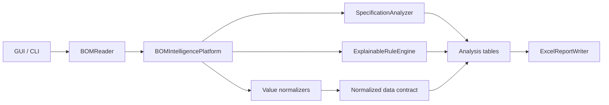

# 架构与扩展指南

## 设计目标

平台采用“输入适配、规格归一化、分析服务、规则决策、报告呈现”分层。GUI、CLI 和
60BOM 标注是入口，不拥有核心判断；Excel 写入器不重新计算业务规则。这样同一个
判断在桌面端、命令行与测试中保持一致。

## 模块职责

| 模块 | 职责 |
| --- | --- |
| `bom_reader.py` | 文件类型、编码、工作表和表头检测；不做规格判断 |
| `value_extractor.py` | 从描述中提取值、耐压、材质、容差、功率和尺寸 |
| `normalizer.py` | 电阻单位与写法转为欧姆数值 |
| `capacitor_normalizer.py` | 电容写法转为统一显示值与 pF 数值 |
| `bom_intelligence.py` | 编排、列映射、标准数据契约、汇总和评分 |
| `specification_analyzer.py` | 封装/耐压/材质差异、AVL、风险视图 |
| `rule_engine.py` | 配置加载、校验、可解释规则命中 |
| `excel_reporter.py` | 原子写入、仪表盘、图表、样式和导出安全 |
| `desktop_app.py` | 参数收集、后台执行、状态与结果操作 |

## 标准数据契约

分析服务应只依赖 `Normalized BOM` 的标准字段，不直接读取源列名。关键字段包括：

- 身份：`Part_Number`, `Reference`, `Vendor`；
- 分类：`Component_Type`；
- 电气：`Normalized_Value`, `Numeric_Value`, `Voltage`, `Material`,
  `Tolerance`, `Power_Rating`；
- 机械：`Package`, `Size`, `Package_Identity`；
- 决策：`Normalize_Key`, `Is_Critical`, `Critical_Reason`；
- 商务：`Quantity_Normalized`, `Unit_Price`, `Lifecycle_Status`；
- 质量：`Data_Quality_Score`, `Review_Status`。

`Normalize_Key` 表示完整规格。相近值比较使用去掉数值后的族群键；封装、耐压或材质
差异比较则只去掉被比较的那个属性。不要用显示文本拼接结果替代结构化字段。

## 扩展器件类型

新增电感、二极管或 IC 归一化时按以下顺序：

1. 在提取器中返回结构化属性和可比较数值；
2. 在平台中建立稳定的 `Normalize_Key`；
3. 在独立分析服务中定义族群键与工程约束；
4. 将新结果表加入 `reports` 字典和 `ExcelReportWriter.SHEETS`；
5. 为常见写法、边界值、关键电路和报告工作表增加测试；
6. 保持既有报告键和 CLI 参数向后兼容，除非发布主版本。

## 可靠性与安全边界

- 输入工作簿用确定性关闭，避免 Windows 文件锁；
- 报告先写随机临时文件，再用 `os.replace` 原子替换；
- 外部文本在写 Excel 前进行公式注入转义；
- JSON 规则加载时校验版本、类型、置信度和 AVL 冲突；
- GUI 只在后台线程执行分析，Tk 控件只在主线程更新；
- 关键电路不会进入自动 Cost Down 清单；
- 报告保留规则来源、版本、输入文件、工作表和表头行用于审计。

## 测试策略

单元测试覆盖三层：

1. 解析层：常见与边界单位、属性提取；
2. 决策层：重复规格、相近值、差异属性、AVL、风险与自定义规则；
3. 交付层：工作表、图表、表格、冻结窗格、公式安全和 60BOM 原表保留。

任何规则行为变化都应先用最小 DataFrame 固化预期，再更新报告断言。